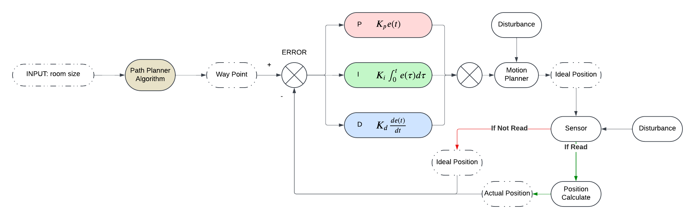
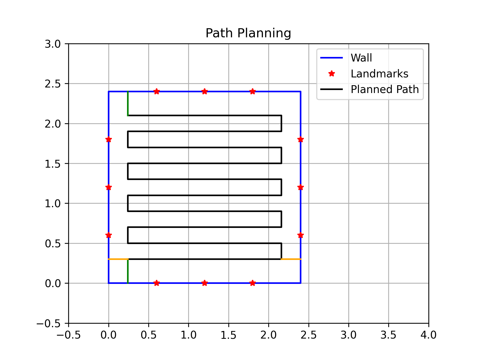
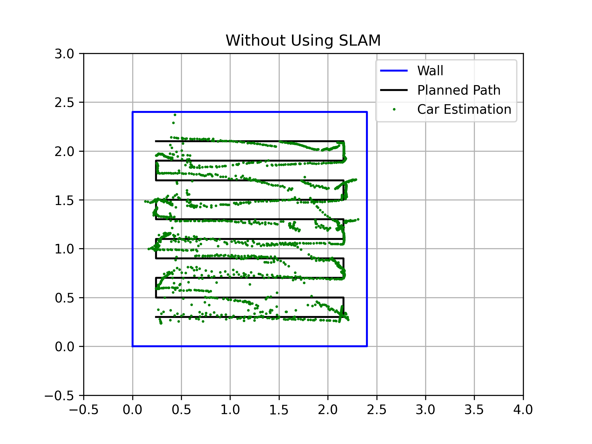

# Autonomous Coverage Path Planning for Mobile Robot

## Authors
**Jiajun Li**  
Email: jil186@ucsd.edu  
Department of ECE, UCSD  

**Tingyu Shi**  
Email: t5shi@ucsd.edu  
Department of ECE, UCSD  

## Abstract
This paper presents the development of an autonomous robot system for coverage path planning (CPP) within a bounded environment. The objective was to design a system capable of navigating a 10ft × 10ft space with predefined landmarks, ensuring complete coverage using localization and control strategies. We employed a grid-based sweep algorithm integrated with a PID control module to achieve accurate motion. The performance of the system was evaluated through real-world experiments, and additional considerations were given to performance guarantees and SLAM-based mapping. Our results demonstrate the effectiveness of our approach in ensuring full coverage while maintaining localization accuracy.

## Introduction
The goal of this project is to develop a robot capable of autonomously navigating and covering a predefined area without relying on obstacle detection. The environment is a 10ft × 10ft space with AprilTag landmarks providing localization cues. Using insights from previous assignments, we implemented a coverage path planning algorithm combined with a motion control strategy to achieve efficient area coverage. This report details the system architecture, path planning methodology, implementation details, and experimental results.

## System Architecture


Our system is composed of three main components: the localization module, the path planning module, and the motion control module. The localization system ensures that the robot maintains an awareness of its position within the bounded environment. The path planning module determines an optimal coverage trajectory, while the motion control module translates the planned path into real-world movement.

## Coverage Path Planning Algorithm
### Algorithm Description
For the path planning algorithm, we used the Grid-based sweep algorithm. The first step is to discretize the space into different grids. Then, we use the center point of each grid to represent this grid. After discretizing the space, it can be considered as a 2D matrix, assuming this matrix has N rows and M columns.

```python
# Pseudocode for Grid-Based Sweep CPP Algorithm
visited = [[False for _ in range(M)] for _ in range(N)]
row_idx, col_idx = N - 1, 0  # Start position
waypoints = []

while True:
    visited[row_idx][col_idx] = True
    x_coord, y_coord = x_coords[row_idx][col_idx], y_coords[row_idx][col_idx]
    waypoints.append([x_coord, y_coord])
    
    if can_move_right():
        col_idx += 1
    elif can_move_left():
        col_idx -= 1
    elif can_move_up():
        row_idx -= 1
    else:
        break
```



## PID Control and Motion Module
For each waypoint, the desired position and pose are set. The error is processed by the PID controller, generating a twist signal, which serves as input for the MPI twist control node. This node sends PWM signals to the motors, moving the robot.

## Results and Evaluation


The robot successfully follows the planned trajectory with minor deviations due to localization noise. The system achieves nearly 100% coverage while maintaining safe distances from the environment boundaries.

### Video Representation
[](https://youtu.be/sCGQzoF28NY)

## Future Work
While our system successfully achieves full coverage path planning within a predefined environment, several enhancements can be made to improve performance and robustness. Future work will explore the following areas:

- **Dynamic Obstacle Avoidance:** Implementing real-time obstacle detection and avoidance using sensor fusion techniques such as LiDAR and depth cameras.
- **Enhanced Localization:** Improving localization accuracy by integrating sensor fusion algorithms, such as Kalman Filters or Particle Filters, to mitigate errors in pose estimation.
- **Adaptive Path Planning:** Developing an adaptive path planning algorithm that dynamically adjusts the coverage strategy based on environmental changes and real-time data.
- **SLAM Integration:** Incorporating a custom SLAM (Simultaneous Localization and Mapping) algorithm to enable the robot to build a map of the environment while performing coverage tasks.
- **Hardware Optimization:** Evaluating and optimizing the motor control system to improve energy efficiency and motion stability.
- **Multi-Robot Coordination:** Extending the system to support multiple robots working collaboratively to achieve efficient coverage in larger areas.

## Conclusion
This work presents a coverage path planning system for an autonomous robot using grid-based planning and PID control. Our approach effectively ensures full area coverage in a predefined environment while leveraging localization for situational awareness. Future work will explore improved localization techniques and dynamic obstacle avoidance.
