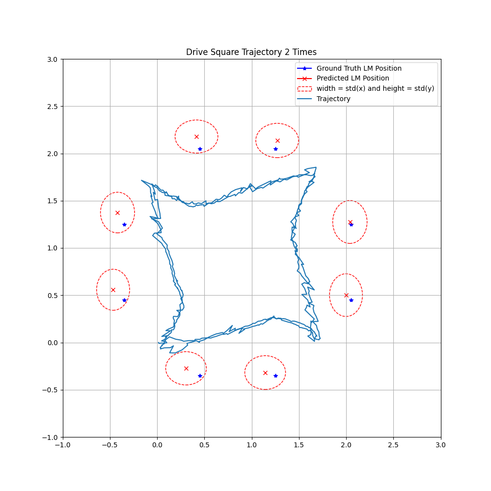

# EKF-SLAM for Autonomous Robot Mapping and Localization

## Authors
**Jiajun Li**  
Email: jil186@ucsd.edu  
Department of ECE, UCSD  

**Tingyu Shi**  
Email: t5shi@ucsd.edu  
Department of ECE, UCSD  

## Abstract
This paper presents the implementation and evaluation of an Extended Kalman Filter (EKF)-based Simultaneous Localization and Mapping (SLAM) system for an autonomous robot. The system is deployed in a structured environment with known landmarks, and the robot navigates through predefined trajectories while estimating its own pose and landmark positions. The EKF-SLAM algorithm is evaluated using two trajectories: a square path and an octagon path. The results are analyzed in terms of mapping accuracy, trajectory estimation, and robustness to sensor noise.

## Introduction
Simultaneous Localization and Mapping (SLAM) is a crucial capability for autonomous robots, enabling them to build maps of unknown environments while localizing themselves within it. In this work, we implement an EKF-SLAM system and evaluate its performance in a controlled environment. The robot navigates a predefined workspace while detecting landmarks and estimating their positions. We analyze the accuracy of the estimated map and trajectory over multiple runs.

## System Setup

The experimental setup consists of a 10ft × 10ft environment with eight landmarks placed along the walls and obstacles. The robot follows two trajectories: a square path (1.7m side length) and an octagon path inscribed within the square. The robot’s onboard sensors detect and track the landmarks for SLAM.

## EKF-SLAM Algorithm
### State Vector and Measurement Vector
For the car itself, the state vector is:
$$x = (x, y, \theta)^T$$
which represents the car's position and orientation in the world coordinate system. For the whole system, the state vector:
$$s = (x, y, \theta, x_{lm1}, y_{lm1} \cdots x_{lmN}, y_{lmN})^T$$
represents the car's state and positions of $N$ landmarks. The measurement vector is:
$$z = (q, \theta^{'})^T$$
where $q$ represents the distance between the car and the landmark, and $\theta^{'}$ represents the angle of the vector from the car to the landmark in the camera coordinate system.

### System and Control Matrices
The system matrix $F$ is an identity matrix:
$$ F = \begin{bmatrix} 1 & 0 & 0 \\ 0 & 1 & 0 \\ 0 & 0 & 1  \end{bmatrix} $$

The control matrix $G$ is:
$$ G = \begin{bmatrix} dt \cos(\theta) & -dt \sin(\theta) & 0 \\ dt \sin(\theta) &  dt \cos(\theta) & 0 \\ 0 & 0 & dt \end{bmatrix} $$

### Measurement Matrix
The Jacobian matrix of $H$ is:
$$ H_{jacobian} = \frac{1}{q} \begin{bmatrix} -\sqrt{q} * \delta_x & -\sqrt{q} * \delta_y & 0 & \sqrt{q} * \delta_x & \sqrt{q} * \delta_y \\ \delta_y & -\delta_x  & -q & -\delta_y & \delta_x \end{bmatrix} $$
where:
- $q$ is the square of the distance between the car and the landmark.
- $\delta_x$ and $\delta_y$ represent the coordinate differences between the car and the landmark.

## Results
### Experiment Setup

### Estimated Landmarks and Trajectory
#### Square Trajectory

#### Octagon Trajectory

### Numerical Results
| Landmark ID | 0 | 1 | 2 | 3 | 4 | 5 | 7 | 8 | Average |
|------------|----|----|----|----|----|----|----|----|---------|
| Error (Square 1x) | 0.0785 | 0.0499 | 0.0036 | 0.0405 | 0.0598 | 0.0694 | 0.0598 | 0.0745 | 0.0545 |
| Error (Square 2x) | 0.1635 | 0.1114 | 0.0725 | 0.0271 | 0.0893 | 0.1332 | 0.1424 | 0.1581 | 0.1122 |
| Error (Octagon 1x) | 0.0790 | 0.0418 | 0.0503 | 0.0162 | 0.0282 | 0.0646 | 0.0631 | 0.0681 | 0.0514 |
| Error (Octagon 2x) | 0.0666 | 0.0288 | 0.0582 | 0.0249 | 0.0372 | 0.0711 | 0.0631 | 0.0640 | 0.0517 |

## Conclusion and Future Work
This study implements and evaluates an EKF-SLAM system for autonomous mapping and localization. The results show that octagon trajectories yield better consistency in localization accuracy. Future work will focus on:
- Improving landmark detection robustness.
- Integrating sensor fusion techniques.
- Evaluating performance in dynamic environments.

## References
1. S. Thrun, W. Burgard, and D. Fox, *Probabilistic Robotics*. MIT Press, 2005.  
2. A. Sakai, "EKF-SLAM Simulation," PythonRobotics, 2024. Available: [GitHub](https://atsushisakai.github.io/PythonRobotics/modules/slam/ekf_slam/ekf_slam.html).  
3. H. Durrant-Whyte and T. Bailey, "Simultaneous localization and mapping: Part I," *IEEE Robotics & Automation Magazine*, vol. 13, no. 2, pp. 99-110, 2006.