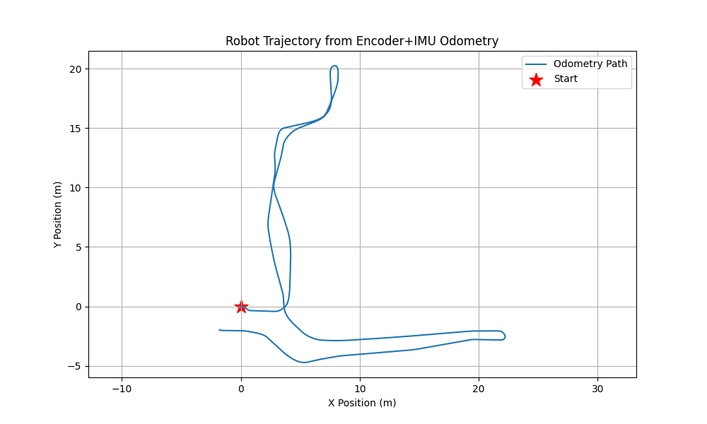
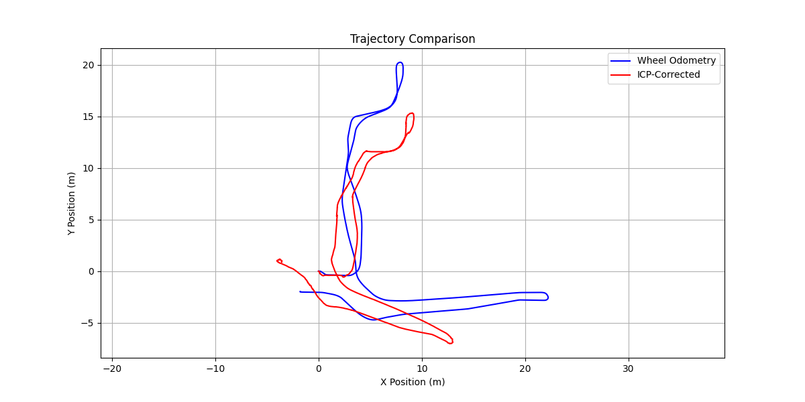
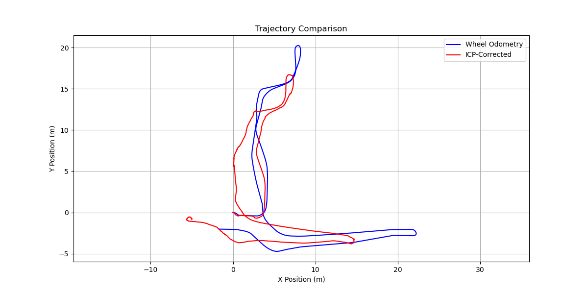
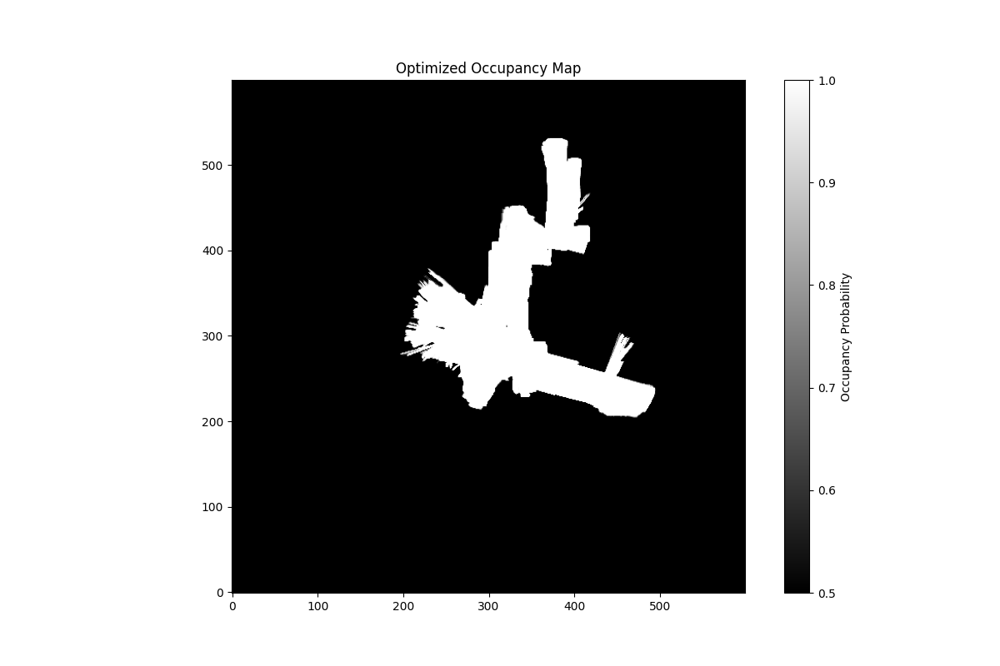
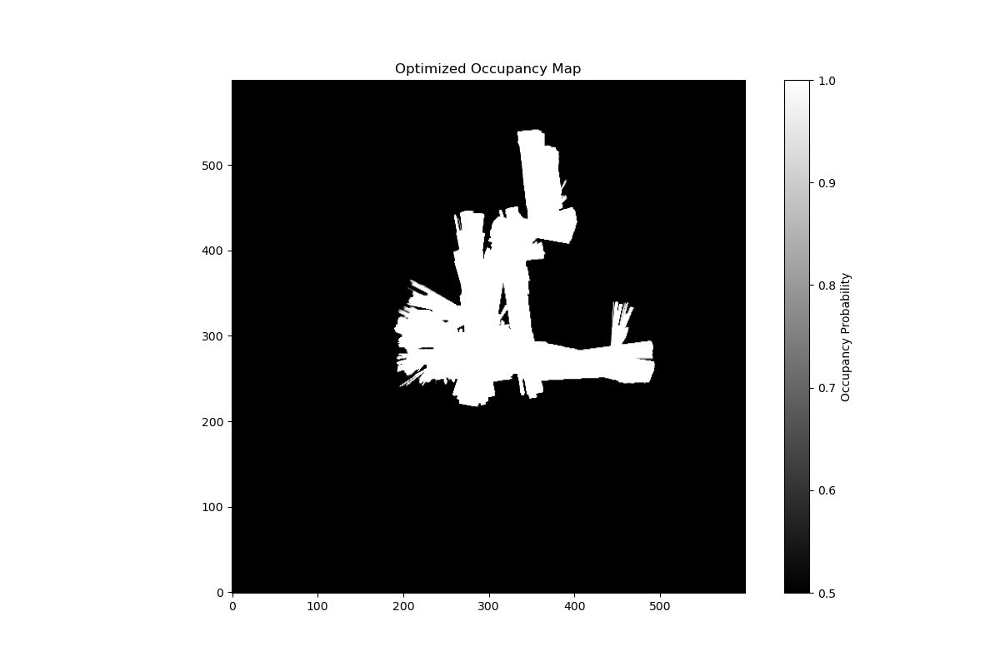
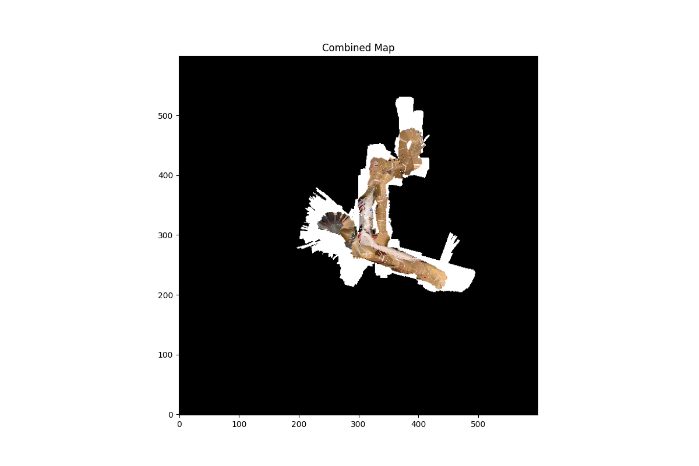

# LiDAR-Based SLAM and Texture Mapping

**Jiajun Li**  
Email: jil186@ucsd.edu  
Department of ECE, UCSD

## Abstract
Simultaneous Localization and Mapping (SLAM) is a cornerstone of autonomous robotics. This project implements LiDAR-based SLAM using encoder-IMU odometry, iterative closest point (ICP) scan matching, and pose graph optimization with GTSAM. We estimate robot trajectories, construct occupancy grid maps, and generate textured floor maps using RGBD data. Loop closure detection and factor graph optimization significantly improve mapping accuracy by reducing cumulative odometry errors.

## Introduction
Autonomous navigation in unknown environments is a fundamental capability for robots, enabling applications from search and rescue to automated inspection. A core challenge lies in accurately estimating the robot’s pose while simultaneously reconstructing the environment—a problem known as Simultaneous Localization and Mapping (SLAM). Sensor noise, motion uncertainties, and cumulative errors make this task particularly demanding for real-world deployment.

This project addresses these challenges by integrating encoder-IMU odometry, LiDAR scan matching, and RGBD sensing. We first predict robot motion using wheel encoders and IMU data, refine the trajectory through iterative LiDAR alignment, and optimize it globally using factor graphs with loop closure constraints. The resulting trajectory enables the construction of precise occupancy grids and textured floor maps. Our approach demonstrates how sensor fusion and optimization techniques mitigate drift and enhance mapping accuracy, providing a robust foundation for autonomous navigation in unstructured environments.

## Problem Formulation
Given a differential-drive robot equipped with encoders, IMU, LiDAR, and RGBD sensors, we aim to estimate its trajectory $\( \{T_t\}_{t=1}^N \in SE(2) $\) (where $\( T_t = [x_t, y_t, \theta_t]^T $\)) and reconstruct a 2D occupancy grid map $\(\mathcal{M}$\) with floor texture. The inputs include:  
- **Encoder counts**: $\(\mathbf{e}_t \in \mathbb{Z}^4$\) (four wheels, 40 Hz).  
- **IMU data**: Yaw rate $\(\omega_t \in \mathbb{R}$\).  
- **LiDAR scans**: $\(\mathcal{L}_t \)$= $`\{\mathbf{p}_i \}_{i=1}^{1081}`$, where $\(\mathbf{p}_i$\) are 2D obstacle coordinates.  
- **RGBD images**: $\(\mathcal{D}_t$\) providing depth and color data.  

The problem is formulated as minimizing a cost function with three components:  
- **Motion model**: Penalize deviations between consecutive poses $\(T_t, T_{t+1}$\) and encoder-IMU odometry predictions.  
- **Observation model**: Minimize LiDAR-to-map alignment errors using iterative closest point (ICP).  
- **Loop closure**: Enforce consistency between temporally distant poses via scan matching.  

The optimization objective is:  
```math
\min_{\{T_t\}, \mathcal{M}} \sum_{t=1}^{N-1} \| T_{t+1} \ominus f(T_t, \mathbf{e}_t, \omega_t) \|^2_{\Sigma_o} + \sum_{t=1}^N \| \mathcal{L}_t \ominus h(T_t, \mathcal{M}) \|^2_{\Sigma_l} + \sum_{(i,j) \in \mathcal{C}} \| T_j \ominus T_i \|^2_{\Sigma_c},
```
where $`f(\cdot)`$ is the differential-drive motion model, $`h(\cdot)`$ projects LiDAR scans to the map $`\mathcal{M}`$, $`\mathcal{C}`$ denotes loop closure pairs, and $`\Sigma_o, \Sigma_l, \Sigma_c`$ represent covariance matrices for odometry, LiDAR, and loop closure uncertainties.  

## Technical Approach

### Encoder-IMU Odometry
1. **Wheel Displacement**: Convert encoder counts $`\mathbf{e}_t = [FR, FL, RR, RL]`$ to linear displacements:  
```math
   \Delta s_{\text{right}} = \frac{(FR + RR)}{2} \cdot 0.0022, \quad \Delta s_{\text{left}} = \frac{(FL + RL)}{2} \cdot 0.0022.
```
2. **Velocity Estimation**: Compute linear ($`v_t`$) and angular ($`\omega_t`$) velocities:  
```math
   v_t = \frac{\Delta s_{\text{right}} + \Delta s_{\text{left}}}{2 \Delta t}, \quad \omega_t = \text{IMU yaw rate}.
```
3. **Pose Update**: Apply differential-drive motion model:  
```math
   \begin{bmatrix}
   x_{t+1} \\ y_{t+1} \\ \theta_{t+1}
   \end{bmatrix}
   =
   \begin{bmatrix}
   x_t + v_t \Delta t \cos\left(\theta_t + \frac{\omega_t \Delta t}{2}\right) \\
   y_t + v_t \Delta t \sin\left(\theta_t + \frac{\omega_t \Delta t}{2}\right) \\
   \theta_t + \omega_t \Delta t
   \end{bmatrix}.
```

### LiDAR Scan Matching via ICP
1. **Point Cloud Generation**: Convert LiDAR ranges to Cartesian points:  
   ```math
   \mathbf{p}_i = r_i \begin{bmatrix} \cos \phi_i \\ \sin \phi_i \end{bmatrix}, \quad \phi_i \in [\theta_{\text{min}}, \theta_{\text{max}}].
   ```
2. **Initial Alignment**: Initialize relative pose using encoder-IMU odometry.  
3. **Pose Interpolation**: Compute interpolated pose at LiDAR timestamps.  
4. **ICP Iteration**:  
   - Transform & match points between scans.  
   - Compute alignment error and update transformation via SVD.  

### Occupancy Grid Mapping
1. **Log-Odds Update**: Update cell probabilities using LiDAR scans.  
2. **Bresenham Ray Tracing**: Update free cells along LiDAR rays.  

### Texture Mapping with RGBD Data
1. **Depth Projection**: Convert disparity to 3D points.  
2. **Floor Extraction**: Filter points near the floor plane.  
3. **Color Assignment**: Map RGB values to grid cells.  

### Pose Graph Optimization with GTSAM
1. **Factor Graph Construction**:  
   - Add odometry and loop closure factors.  
2. **Optimization**: Solve using Levenberg-Marquardt algorithm.  

## Results

### Trajectory Estimation
**Figure 1 (top): Raw odometry trajectory**\
**Figure 1 (middle): ICP-corrected trajectory**\
**Figure 1 (bottom): GTSAM-optimized trajectory**
<p align="center"></p>
<p align="center"></p>
<p align="center">
</p>

### Occupancy Grid Mapping
**Figure 2 (left): Unoptimized map**\
**Figure 2 (right): Optimized map**
<p align="center"></p>

### Texture Mapping
**Figure 3: Textured floor map**
<p align="center"></p>

## Conclusion
This project demonstrated a complete LiDAR-based SLAM pipeline integrating encoder-IMU odometry, ICP scan matching, and factor graph optimization. The results validated the effectiveness of loop closure in reducing trajectory drift. The textured maps provide actionable environmental representations for navigation tasks. Future work will focus on real-time performance and 3D extensions.

## References
1. GTSAM Development Team, "Georgia Tech Smoothing and Mapping Library," 2025. [Online]. Available: https://gtsam.org  
2. Nikolay Atanasov, "Motion and Observation Models," ECE276A: Sensing & Estimation in Robotics, UCSD, 2025.  
3. Nikolay Atanasov, "Localization and Odometry from Point Features," ECE276A: Sensing & Estimation in Robotics, UCSD, 2025.  
