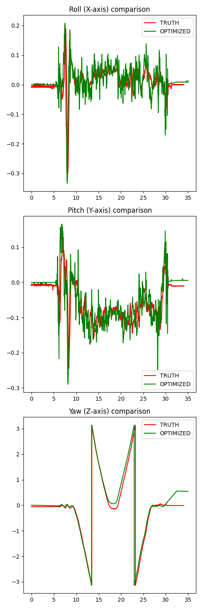
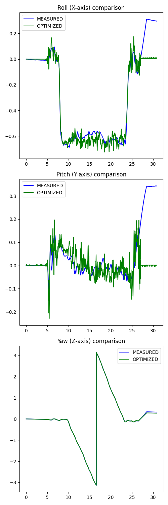
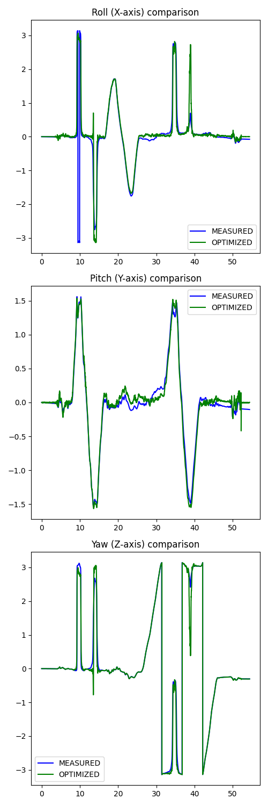
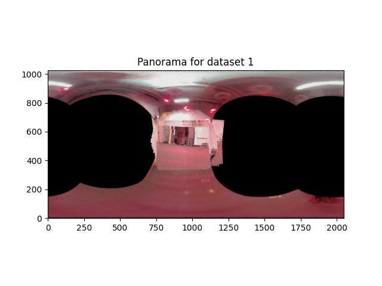
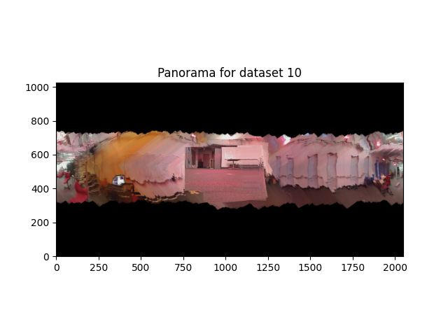

# Orientation Tracking and Panorama Construction

**Orientation Tracking and Panorama Construction**  
**Author:** Jiajun Li  
**Email:** [jil186@ucsd.edu](mailto:jil186@ucsd.edu)  
**Department of ECE, UCSD**  
**Date:** February 3, 2025

## Abstract

Orientation tracking is crucial in robotics for navigation, mapping, and object manipulation. This project implements a projected gradient descent algorithm to estimate orientation from IMU data and uses these estimates to generate a panoramic image by stitching camera images. Our approach optimizes quaternion-based orientation while enforcing unit norm constraints.

## Introduction

Orientation tracking is a fundamental problem in robotics, where accurate estimation of an object's rotational state is essential. Our approach leverages IMU measurements and quaternion optimization for accurate orientation tracking, followed by panoramic image construction.

## Problem Formulation

We define the orientation at time $\( t \)$ as a unit quaternion $\( q_t \in \mathbb{H}^* \)$. Given IMU angular velocity $\( \omega_t \in \mathbb{R}^3 \)$ and acceleration $\( a_t \in \mathbb{R}^3 \)$, our goal is to estimate the quaternion trajectory $\( q_{1:T} \)$ by minimizing the cost function:

```math
c(q_{1:T}) = \frac{1}{2} \sum_{t=0}^{T-1} \| 2 \log ( q_{t+1}^{-1} \circ f(q_t, \tau_t \omega_t) ) \|_2^2 + \frac{1}{2} \sum_{t=1}^{T} \| [0, a_t] - h(q_t) \|_2^2
```

where:

- The **motion model** is:
  ```math
  q_{t+1} = f(q_t, \tau_t \omega_t) := q_t \circ \exp([0, \tau_t \omega_t / 2])
  ```
- The **observation model** is:
  ```math
  [0, a_t] = h(q_t) := q_t^{-1} \circ [0, 0, 0, -g] \circ q_t
  ```
- The **unit norm constraint** is enforced for all \( t \):
  ```math
  \|q_t\|_2 = 1
  ```

## Technical Approach

### Orientation Tracking

1. **IMU Calibration:** To calibrate the IMU, we take the mean of the first few seconds of the data, assuming that the IMU is in a static state during this period. This mean value is then subtracted from all subsequent IMU readings to correct for bias. For the accelerometer values, we follow the same approach but additionally add 1 to the z-axis to account for gravitational acceleration.
2. **Motion Model Prediction:** We precompute the initial quaternion over all time steps to establish a reference trajectory. During the optimization process, this precomputed quaternion is used to subtract the motion model output, ensuring a stable reference for iterative corrections.
3. **Observation Model Correction:** The measured values from the IMU are used to correct the observation model, which takes the quaternion as input. This correction step ensures that the estimated trajectory aligns closely with real-world measurements.
4. **Quaternion Normalization:** In each iteration of the optimization process, we normalize the quaternion to enforce the unit norm constraint. This step is crucial for maintaining valid quaternion representations and ensuring the stability of the orientation estimation process.

### Panorama Construction

1. **Time Alignment:** Since the timestamps of the images differ from the IMU data, we need to associate each image with the closest IMU measurement. This is done by selecting the IMU data point with the smallest time difference relative to the image timestamp.
2. **Grid Construction and Transformation:** Before mapping the image onto the panorama, we construct a grid based on the camera's field of view (FOV). This grid represents the image projection from a 2D plane to a spherical surface. The grid is then transformed into Cartesian coordinates, where it undergoes a rotation using the previously calculated quaternion. After rotation in Cartesian space, the transformed grid points are converted back into spherical coordinates. This ensures that the image pixels are correctly aligned with the panoramic projection.
3. **Image Stitching:** During the stitching process, we map the spherical coordinates to the panorama's coordinate system based on its predefined parameters. Each image pixel is then assigned to its corresponding position on the panorama, ensuring a seamless construction.

## Results

### Orientation Tracking

- **Training Results:** The estimated roll, pitch, and yaw angles compared to the VICON ground truth demonstrate the accuracy of our approach.
<p align="center">

</p>

- **Test Results:** The estimated and optimized roll, pitch, and yaw angles for the test dataset remain consistent with the training set, indicating good generalization.
<p align="center">

</p>


### Panorama Construction

- **Generated Panorama:** The constructed panoramic images illustrate the effectiveness of our approach in correctly stitching the camera frames based on the estimated orientations.
<p align="center">

</p>
<p align="center">

</p>

- **Discussion:** The orientation tracking results show that our projected gradient descent optimization effectively minimizes errors between estimated and ground truth angles. The panoramic image generated from the test set appears chaotic because the camera movement involved both rotation and translation within the world frame. However, our panorama construction method only accounts for rotational motion. As a result, the misalignment caused by the unaccounted translation leads to a distorted and disordered final panorama.

## Further Work

- Improve the panorama construction by accounting for camera translation in addition to rotation.
- Refine the quaternion estimation process to reduce distortions in the final panorama.
- Implement a more robust image stitching algorithm to handle misalignments better.
- Test the approach on additional datasets to evaluate generalization performance.
- Optimize computational efficiency for real-time orientation tracking and panorama generation.

## Conclusion

The project successfully implemented an orientation tracking system using projected gradient descent optimization, which effectively estimated roll, pitch, and yaw angles. The results showed a close match with the ground truth data, indicating the accuracy of the approach. The panoramic image construction demonstrated the feasibility of aligning images based on estimated orientations, although some distortions were observed due to limitations in handling translation effects. Future improvements should focus on refining quaternion estimation, incorporating translation effects into the panorama generation process, and optimizing computational efficiency for real-time applications.

## References

1. Nikolay Atanasov, "Lecture 5: Factor Graph SLAM," ECE276A: Sensing \& Estimation in Robotics, UCSD, 2025. [8-11].
