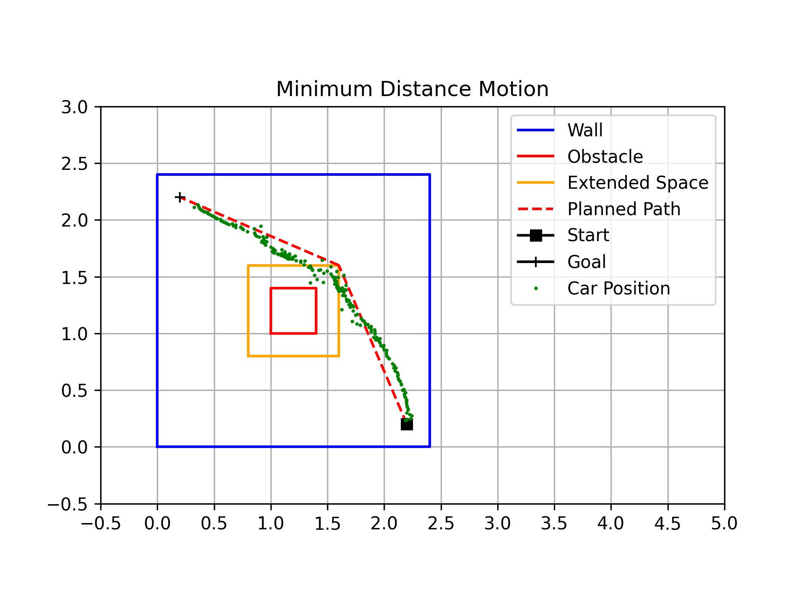

# Path Planning for Autonomous Robot Navigation: Maximum Safety vs. Minimum Distance

## Authors
**Jiajun Li**  
Email: jil186@ucsd.edu  
Department of ECE, UCSD  

**Tingyu Shi**  
Email: t5shi@ucsd.edu  
Department of ECE, UCSD  

## Abstract
This paper presents the implementation of two distinct path planning algorithms for an autonomous robot navigating a predefined environment with obstacles. The objective was to design a path planner that balances two criteria: maximum safety and minimum distance. The maximum safety approach ensures that the robot follows a path that maintains the greatest possible distance from obstacles, while the minimum distance approach determines the shortest possible route between a start and goal point. We evaluate the performance of both methods in a controlled experimental setup and provide comparative analysis.

## Introduction
Path planning is a fundamental problem in robotics, impacting applications from autonomous navigation to industrial automation. In this work, we explore two contrasting approaches: maximizing safety versus minimizing distance. The environment consists of a 10ft × 10ft workspace with known landmarks and an obstacle. The start and goal points are placed diagonally across the workspace. This paper describes the design choices, algorithms, and results obtained through real-world experiments.

## System Architecture

As illustrated in the figure above, the majority of the model remains consistent with the previous assignment. However, in this version, we do not directly provide waypoints to the robot. Instead, the waypoints are generated by a path planner algorithm. For this task, we have implemented two distinct path planning algorithms: the Maximum Safety Algorithm and the Minimum Distance Algorithm.

- The **Maximum Safety Algorithm** focuses on creating a path that keeps the robot as far from obstacles as possible, ensuring its safety.
- The **Minimum Distance Algorithm** seeks to determine the shortest route from the starting point to the goal.

## Path Planning Algorithms
### Minimum Distance Path Planning

For minimum distance path planning, we used the visibility graph and Dijkstra algorithm. We set an extended space (orange square) around the obstacle to prevent collisions. Then, we generated the visibility graph (represented by the green lines) using the following points:

- 4 corners of the wall
- 4 corners of the extended space
- Start and goal points

After obtaining the visibility graph, we applied Dijkstra's algorithm to compute the shortest path, which is represented by the red dashed line.

### Maximum Safety Path Planning

For maximum safety path planning, we first used the Voronoi algorithm to generate sample points. The black dots represent the wall and the obstacle, while the blue dots represent the Voronoi samples. Then, we used **KNN (N=5)** to connect the blue dots to generate a graph (green lines). Finally, Dijkstra's algorithm was used to determine the safest path from start to goal (red dashed line).

## Experimental Results
### Minimum Distance Path Execution

In the figure above, the red dashed line represents the planned path for minimum distance, while the green dots represent the estimated car's position. Localization noise causes slight deviations from the planned path.

### Maximum Safety Path Execution

For the maximum safety approach, the red dashed line represents the planned path, while the green dots show the estimated positions. Despite some localization errors, the robot follows the path and maintains a safe distance from obstacles.

## Conclusion and Future Work
This work presents two contrasting approaches to path planning for autonomous navigation. The **minimum distance algorithm** effectively computes the shortest route using visibility graphs and Dijkstra’s algorithm, while the **maximum safety approach** leverages Voronoi diagrams for obstacle avoidance. Experimental results validate both methods, demonstrating their effectiveness in different scenarios.

### Future Work
- Integrating dynamic obstacle avoidance mechanisms
- Enhancing localization accuracy using sensor fusion techniques
- Developing adaptive planning methods that balance safety and efficiency in real-time

These improvements will further enhance the robustness of autonomous navigation systems.

## References

1. A. Sakai, "Visibility Road Map," PythonRobotics, 2024. Available: [GitHub](https://github.com/AtsushiSakai/PythonRobotics/tree/master/PathPlanning/VisibilityRoadMap).
2. A. Sakai, "Voronoi Road Map," PythonRobotics, 2024. Available: [GitHub](https://github.com/AtsushiSakai/PythonRobotics/tree/master/PathPlanning/VoronoiRoadMap).
