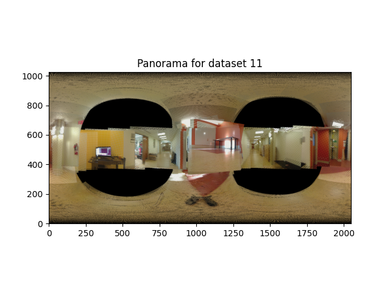

# Robotics

Welcome to the **Danny's** Robotics Repository! This repository contains multiple projects related to **robotics sensing, path planning, and Simultaneous Localization and Mapping (SLAM).** Each project has its own dedicated folder with a `README.md` file and a PDF description explaining its details.


## 📂 Repository Structure

### 1. [Orientation Tracking](./Orientation_Tracking/Orientation_Tracking_&_Panorama.pdf)
   - **Description:** This project implements a projected gradient descent algorithm to estimate 3D orientation from IMU data using quaternion optimization, enforcing unit norm constraints. The estimated orientations are then used to construct panoramic images by stitching camera frames projected onto a spherical surface. Results show accurate orientation tracking and effective panorama generation, with some distortion due to unmodeled camera translation.

   - **Demonstration:**
   <p align='center'>
   
   </p>

### 2. [Max Safe & Min Dist Path Planning](./Max_Safe_&_Min_Dist_Path_Planning/Max_Safe_&_Min_Dist_Path_Planning.pdf)
   - **Description:** This project implements two path planning strategies for autonomous robot navigation: one prioritizing minimum distance using visibility graphs and Dijkstra’s algorithm, and the other maximizing safety through Voronoi-based obstacle avoidance. Both methods were tested in a controlled environment, with the robot successfully following planned paths while accounting for localization noise. Results show a clear trade-off between path efficiency and safety, informing future work on adaptive and dynamic planning systems.

   - **Demonstration:**
   
   [](https://youtu.be/pjOQJUsrepY)
   [](https://youtu.be/FdMfx6F-wpE)

### 3. [Coverage Path Planning](./Coverage_Path_Planning/Autonomous_CPP_report.pdf)
   - **Description:** This project develops an autonomous robot system for coverage path planning (CPP) within a 10ft × 10ft bounded environment using AprilTag landmarks for localization. The system employs a grid-based sweep algorithm to generate zigzag paths and integrates PID control for precise motion, achieving near-complete coverage while maintaining safe distances from walls. Experimental results validate its effectiveness, with future enhancements targeting dynamic obstacle avoidance, improved localization, and SLAM integration for broader applicability.
   - **Demonstration:**

   [<p align='center'></p>](https://youtu.be/sCGQzoF28NY)

### 4. [EKF-SLAM with AprilTag](./EKF-SLAM_with_AprilTag/EKF-SLAM.pdf)
   - **Description:** This project implements an Extended Kalman Filter (EKF)-based SLAM system for autonomous robots, enabling simultaneous localization and mapping in a structured 10ft × 10ft environment with predefined landmarks. By testing square and octagon trajectories, the system demonstrates improved robustness and lower average landmark estimation errors (0.0514m vs. 0.0545m) with the octagon path, validated through covariance analysis and error metrics. The work highlights the impact of trajectory design on SLAM accuracy, with applications in enhancing autonomous navigation in controlled environments.
   - **Demonstration:**
   <p align='center'>
      
   </p>

### 5. [LiDAR-SLAM and Texture Mapping](./LiDAR-SLAM_and_Texture_Mapping/LiDAR-Based%20SLAM%20and%20Texture%20Mapping.pdf)
   - **Description:** This project develops a LiDAR-based SLAM system that integrates encoder-IMU odometry, ICP scan matching, and GTSAM pose graph optimization to enable autonomous robot navigation and mapping in unstructured environments. By fusing LiDAR, RGBD, and motion sensor data, the system constructs precise occupancy grids and textured floor maps, reducing trajectory drift through loop closure detection and factor graph optimization. Experimental results demonstrate enhanced mapping accuracy, with future improvements focusing on real-time processing, 3D extensions, and semantic integration for advanced environmental perception.
   - **Demonstration:**
   <p align='center'>
      
   </p>

### 6. [VI-SLAM using EKF](./VI-SLAM_using_EKF/Visual-Inertial%20SLAM%20using%20Extended%20Kalman%20Filter.pdf)
   - **Description:** This project develops a Visual-Inertial SLAM system using an Extended Kalman Filter (EKF) to fuse IMU and stereo camera data, enabling 6-DOF pose estimation and 3D landmark mapping in GPS-denied environments. The approach integrates SE(3) kinematics for IMU trajectory prediction, stereo triangulation for landmark initialization, and joint optimization to refine pose and map estimates while mitigating scale drift and sensor noise. Experimental results validate reduced trajectory drift compared to IMU-only localization, though landmark-induced vibrations highlight opportunities for improved filtering and real-time performance in future work.
   - **Demonstration:**
   <p align='center'>
      
   </p>

### 7. [Dynamic Programming for DoorKey Navigation](./Dynamic_Programming_for_DoorKey_Navigation/Dynamic_Programming_for_DoorKey_Navigation.pdf)
   - **Description:** This project develops a Dynamic Programming approach using value iteration to solve the DoorKey navigation challenge in Mini-Grid environments, formulating the task as a Markov Decision Process (MDP) with state representations tracking agent position, orientation, key possession, and door statuses. The method extends to randomized maps by augmenting the state space to account for variable key/goal positions and multiple door interactions, ensuring complete observability and optimal policy computation. Experimental validation demonstrates successful navigation in 7 predefined and 36 randomized 10x10 grid configurations, achieving minimal path lengths while handling directional constraints and object interactions through systematic state-space exploration.
   - **Demonstration:**
   <p align='center'>
      
   </p>
   
### 8. [Weighted A* and RRT in 3D Environments](./Weighted_A_and_RRT_Algorithms_in_3D/Weighted_A_and_RRT_in_3D_Environments.pdf)
   - **Description:** This project develops an integrated 3D motion planning framework including weighted A* and RRT algorithms to navigate obstacle-rich environments, utilizing a slab-based collision detection system for safety verification and adaptive heuristics for balancing optimality and efficiency. It demonstrates robust performance in cluttered scenarios through innovations like dynamic grid resolution, goal-biased sampling, and memory-efficient node management, achieving guaranteed collision-free paths with bounded suboptimality (A*) and probabilistic completeness (RRT).
   - **Demonstration:**
   <p align='center'>
      
      
   </p>


## 🔧 Getting Started

1. Clone this repository:
   ```sh
   git clone https://github.com/DannyLi001/Robotics.git
   cd Robotics
