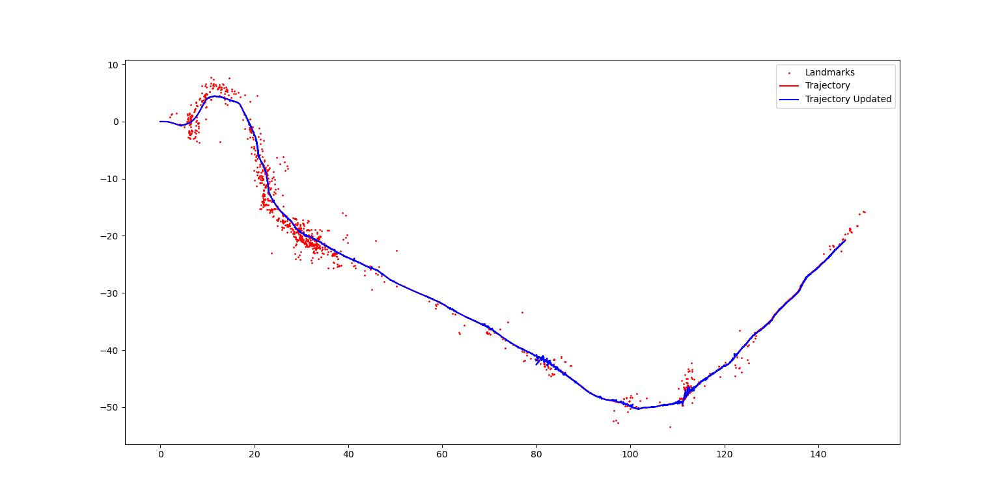

# Visual-Inertial SLAM using Extended Kalman Filter

## Abstract
Visual-Inertial Simultaneous Localization and Mapping (SLAM) is critical for autonomous navigation in GPS-denied environments. This project implements an Extended Kalman Filter (EKF) to jointly estimate the robot's 6-DOF pose and 3D landmark positions by fusing IMU measurements and stereo camera observations. Our approach combines SE(3) kinematics for IMU prediction and a sparse landmark mapping framework. The results demonstrate accurate trajectory estimation and landmark reconstruction on real-world datasets.

## Introduction
Visual-Inertial Simultaneous Localization and Mapping (VI-SLAM) enables robots to concurrently estimate their motion and reconstruct their surrounding environment using onboard sensors. In this framework, Inertial Measurement Units (IMUs) provide high-frequency odometry estimates, capturing rapid motion dynamics, while stereo cameras offer rich spatial constraints by tracking visual features across frames. The fusion of these complementary modalities allows for more accurate and drift-resistant state estimation.

This work presents an Extended Kalman Filter (EKF)-based VI-SLAM solution that effectively integrates inertial and visual data, addressing key challenges in state estimation within the SE(3) motion space. Specifically, we focus on handling scale drift, feature association, and computational efficiency, which are critical for real-time operation. Additionally, our approach incorporates robust landmark management strategies to maintain map consistency as the robot explores large-scale environments.

Autonomous navigation in GPS-denied, unstructured environments demands a self-contained localization system that can operate without external infrastructure. While modern VI-SLAM implementations commonly leverage factor graph optimization for high-precision mapping, these methods can be computationally expensive and unsuitable for resource-limited robotic platforms. Instead, our work demonstrates the feasibility of an EKF-based approach that prioritizes low-latency state updates and real-time performance, making it well-suited for embedded systems and mobile robotics applications.

## Problem Formulation
The system employs a three-stage estimation process that decouples then refines state variables:

$$
x_t = \begin{cases}
T_t^I \in SE(3) & \text{(Stage 1: IMU Localization)} \\
\{m_j\}_{j=1}^M \in \mathbb{R}^{3M} & \text{(Stage 2: Landmark Mapping)} \\
(T_t^I, \{m_j\}) & \text{(Stage 3: Joint SLAM)}
\end{cases}
$$

### Stage 1: IMU Trajectory Prediction
In stage 1 we predict the IMU trajectory using $\mathrm{SE}(3)$ kinematics: the robot's pose $T_t^I$ is propagated via the exponential map of the twist formed by linear velocity $\mathbf{v}_t$ and angular velocity $\boldsymbol{\omega}_t$, scaled by the time interval $\tau_t$.

### Stage 2: Landmark Initialization & Update
Now we need to initialize landmarks via stereo triangulation, solving a least-squares problem to estimate 3D positions $m_j$  
from the first stereo observations, then refining them using an EKF. The update step computes the Kalman gain $K_{t+1}$ to correct landmark estimates
($\mu_{t+1}$) and covariance ($\Sigma_{t+1}$) based on the discrepancy between observed and predicted pixel coordinates, with the Jacobian $H_{t+1}$ 
encoding how landmark positions affect observations.

### Stage 3: Trajectory Refinement
Jointly optimize using both sensors:

$$
p(x_{0:T}|\mathbf{z}, \mathbf{v}, \boldsymbol{\omega}) \propto 
\prod_{t=1}^{T} p(T_t^I | T_{t-1}^I, \mathbf{v}, \boldsymbol{\omega}) 
\prod_{t=0}^{T} \prod_{j=1}^{M} p(\mathbf{z}_t^j | T_t^I, m_j)
$$

## Technical Approach
### IMU Localization via EKF Prediction
1. **SE(3) Kinematics**:
   According to the discrete-time pose kinematics with constant:

$$T_{t+1} = T_t \exp\left(\tau_t \xi^\wedge_k\right)$$
   
   We can propagate pose using Lie algebra:
   
$$
T_{t+1}^I = T_t^I \exp( \tau_t  \begin{bmatrix} 
\mathbf{v}_t  \\
\boldsymbol{\omega}_t 
\end{bmatrix}^\wedge )
$$

2. **Covariance Propagation**:

   
$$\Sigma_{t+1|t} = Ad(\exp(-\tau_t u_t)) \Sigma_{t|t} Ad(\exp(-\tau_t u_t))^\top + W$$
   
   where $W$ is IMU noise covariance and $\text{Ad}$ is the adjoint map for SE(3).

### Landmark Mapping via EKF Update

We have now obtained the trajectory of the robot over time and its covariance. Next, we need to build up the landmarks' position in the world frame. We have landmarks' pixel coordinates in both cameras. To obtain the location of the landmarks in the world frame, we implement triangulation.

1. **Triangulation**: For the first observation of landmark \(j\):

  $$m_j = argmin_{m} \sum_{c \in \{L,R\}} || \mathbf{z}_{t,j}^c - K_c \pi\left({}^c T_I T_t^{-1} m \right) ||^2$$

  To solve this optimization problem, we use the SVD technique and take the smallest singular value.

2. **Landmarks Filtering**: After initializing all the landmarks, we perform filtering to remove landmarks that are too far or too close to the camera:

  $$d_{close} \leq d_{j,t} = |m_j^{(x,y)} - t_t^{(x,y)}| \leq d_{far}$$

  We also discard the points that have a negative x-position with respect to the camera, since we cannot observe points behind the camera.

4. **EKF Update**: We then refine the estimated landmarks via EKF update:

$$K_{t+1} = \Sigma_t H_{t+1}^{T} \left(H_{t+1} \Sigma_t H_{t+1}^{T} + I \otimes V \right)^{-1}$$
$$\mu_{t+1} = \mu_t + K_{t+1}(z_t - K_s\pi(^cT_I T_{t+1}^{-1}\mu_t)) $$
$$\Sigma_{t+1} = (I - K_{t+1} H_{t+1})\Sigma_t$$

   where

   $$
   H_{t,j} = \begin{bmatrix} K_l J_\pi ^L T_I T_t^{-1} P^T \\ 
   K_r J_\pi ^R T_I T_t^{-1} P^\top \end{bmatrix} \in \mathbb{R}^{4 \times 3}
   $$

   $$
   J_\pi = \frac{d\tau}{d\mathbf{q}}(\mathbf{q}) = \frac{1}{q_3}\begin{bmatrix}
   1 & 0 & -\frac{q_1}{q_3} & 0\\
   0 & 1 & -\frac{q_2}{q_3} & 0\\
   0 & 0 & 0 & 0
   \end{bmatrix} \in \mathbb{R}^{3\times4}
   $$

### Visual-Inertial SLAM
Similar to landmark updating, we update the pose of the robot via EKF update:

$$
\hat{\xi} \mathbf{s} = \mathbf{s}^\odot \xi
$$

$$
\begin{bmatrix} \mathbf{s} \\ 
1 \end{bmatrix}^\odot :=
\begin{bmatrix}
I & -\hat{\mathbf{s}} \\
0 & 0
\end{bmatrix} \in \mathbb{R}^{4 \times 6}
$$

## Results
### Observations
- **Trajectory and Landmarks Prediction**: The IMU-only trajectory exhibits characteristic drift in position. The open-loop nature is evident from the diverging path structure. Initial landmarks show sparse coverage with clustering near the trajectory start, consistent with limited parallax during initial motion.
- **Trajectory and Landmarks Updates**: Preliminary landmark adjustments demonstrate subsets of landmarks shifting toward more physically plausible configurations. The updated trajectory shows some vibration due to the covariance of the landmarks and the observation noise. However, due to the naive filtering strategy, some landmarks have a worse effect on the update, which magnifies the vibration of the trajectory.

